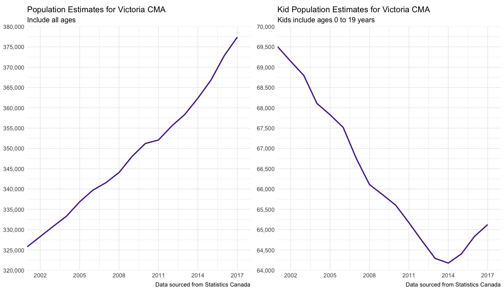
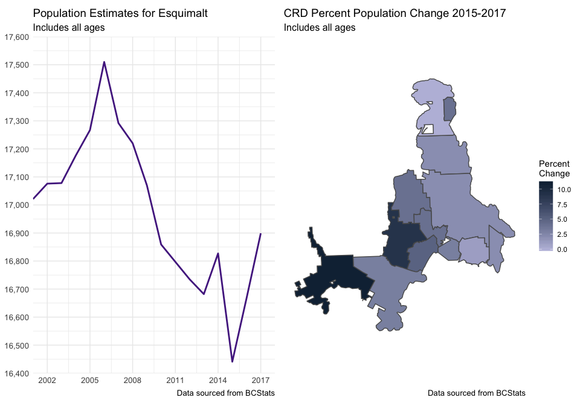

<!-- 
This file is licensed with the Creative Commons Attribution 4.0 International License.
-->

## The Kids Are Coming, Let’s Get Ready

We are in the campaign period for the British Columbia [2018 General
Local
Elections](https://elections.bc.ca/political-participants/local-elections-campaign-financing/2018-general-local-elections/).
I live in the Township of Esquimalt 🏙—an amazing community. However,
there is always room to improve, even on amazing. I have enjoyed talking
with our local government candidates, in particular about what issues
motivated them to campaign to step into such important roles—the housing
crisis, responsible development, community building. In turn, I have had
a fair bit to say about issues on my mind, such as climate change ([this
😱](https://www.ipcc.ch/news_and_events/pr_181008_P48_spm.shtml)),
reducing speed limits in neighbourhood areas 🚗, more and safer bike
paths for family cycling 🚲, and, *schools*. Specifically, space in our
only catchment elementary school—[L’Ecole Macaulay
Elementary](https://macaulay.sd61.bc.ca/).

Esquimalt used to have 2 catchment elementary schools, Lampson Street &
Macaulay ([Ecole
Victor-Brodeur](https://en.wikipedia.org/wiki/%C3%89cole_Victor-Brodeur)
is also in Esquimalt, a school that serves the francophone community).
Lampson, a school building with [an impressive history in the
region](https://victoriadailyphoto.blogspot.com/2013/05/lampson-street-school.html),
was closed as a catchment elementary school in 2007 due to declining
enrolment.

However, things have and are changing—and pretty *fast*.

Due to the recent, legal change to [revert class size & composition back
to 2002 levels](https://bctf.ca/IssuesInEducation.aspx?id=5530), as well
as a growing population—Macaulay has added one or more new classes in
each of the 3 years I have had kids in the school, as have many
elementary schools throughout the Capital Regional District. Macaulay
has over 470 kids enrolled this year, so I have been talking 🗣 to
candidates about how Macaulay is pretty *full*—and I think we need a
plan for the kids that are still to come.

I thought it would be interesting to support this discussion with some
*data*. Also, I am always keen to work on my
[R](https://www.r-project.org/) skills 👩‍💻. So here it goes.

#### Population Change in Victoria Census Metropolitan Area (2001-2017)

Let’s start by pulling some population estimate data from Statistics
Canada—I found data for each Census Metropolitan Area by age group.
Perfect. I had to Google to learn about what the Victoria Census
Metropolitan Area (CMA) actually includes (🤦‍♀), turns out it includes
[all of the Capital Regional District minus the Gulf
Islands](https://www12.statcan.gc.ca/census-recensement/2011/as-sa/fogs-spg/Facts-cma-eng.cfm?LANG=Eng&GK=CMA&GC=935).
Let’s have a look 👀:

<details>

<summary><i>Click to see the R code for the Victoria CMA
plots</i></summary>

``` r
## Data: Victoria Census Metropolitan Census Area (British Columbia) Population
## Estimates [Table: 17-10-0078-01 (formerly CANSIM  051-0056) from Statistics Canada

#get Statistics Canada data using cansim package
bc_popn <- get_cansim(1710007801) %>%
  filter(GEO == "Victoria, British Columbia",
         Sex == "Both sexes") %>%
  select(year = REF_DATE, age_group = `Age group`, population_estimate = VALUE) %>% 
  mutate(year = as.integer(year))

#make plot of Victoria CMA population estimates
cma_plot <- bc_popn %>% 
  filter(age_group == "All ages") %>% 
  ggplot(aes(x = year, y = population_estimate, group = 1)) + 
  geom_line(size = 1, colour = "#54278f") +
  scale_x_continuous(limits = c(2001, 2018),
                     breaks = seq(2002, 2017, 3),
                     expand = c(0,0)) +
  scale_y_continuous(limits = c(320000, 380000),
                     breaks = seq(320000, 380000, 5000),
                     expand = c(0,0), labels = comma) +
  labs(title = "Population Estimates for Victoria CMA",
       subtitle = "Include all ages",
       caption = "Data sourced from Statistics Canada") +
  theme_minimal() +
  theme_plots

#kid age groups
kid_ages <- c("0 to 4 years", "5 to 9 years", "10 to 14 years", "15 to 19 years")

#make plot of kid Victoria CMA population estimates
cma_kids_plot <- bc_popn %>% 
  filter(age_group %in% kid_ages) %>% 
  group_by(year) %>% 
  summarise(population_estimate = sum(population_estimate)) %>% 
  ggplot(aes(x = year, y = population_estimate, group = 1)) + 
  geom_line(size = 1, colour = "#54278f") +
  scale_x_continuous(limits = c(2001, 2018),
                     breaks = seq(2002, 2017, 3),
                     expand = c(0,0)) +
  scale_y_continuous(limits = c(64000, 70000),
                     breaks = seq(64000, 70000, 500),
                     expand = c(0,0), labels = comma) +
  labs(title = "Kid Population Estimates for Victoria CMA",
       subtitle = "Kids include ages 0 to 19 years",
       caption = "Data sourced from Statistics Canada") +
  theme_minimal() +
  theme_plots
```

``` r
#plot the Victoria CMA plots
cma_plot + cma_kids_plot
```

</details>

<!-- -->

The Statistics Canada data confirms what we hear all the time, the
population in the Victoria CMA has been steadily increasing since 2001.
But *not* due to more kids—the population of 0 to 19 year olds steadily
declined from 2001 until 2014. This explains the decline in
enrolment—and School District decisions to close schools at that time.
However, 2014 brings a clear change—kid numbers start increasing. But
what about in the Township of Esquimalt?

#### Population Change in the Township of Esquimalt (2001-2017)

I found some population data for Municipalities from
[BCStats](https://www2.gov.bc.ca/gov/content?id=36D1A7A4BEE248598281824C13CB65B6),
but unfortunately not by age group 😞.

<details>

<summary><i>Click to see the R code for the Esquimalt plot &
map</i></summary>

``` r
## Data: Esquimalt District Municipality population estimates from
## BCStats Population Estimates webpage

#municipalities I want
crd <- c("Central Saanich", "Colwood", "Esquimalt", "Highlands",
         "Langford", "Metchosin", "North Saanich", "Oak Bay", "Saanich",
         "Sidney", "Sooke", "Victoria", "View Royal")

#get the 2001-2011 CRD population estimate data file 
bcstats_mun_2001_2011 <- 
  "http://www.bcstats.gov.bc.ca/Files/0379a32f-cec8-438d-83e0-6724b2a2a272/BCDevelopmentRegionRegionalDistrictandMuncipalPopulationEstimates2001-2011.xls"

get_mun_2001_2011 <- curl_download(bcstats_mun_2001_2011,
                                   destfile = glue(path, "/bcstats_mun_2001_2011.xls"))

crd_2001_2011 <- read_xls(get_mun_2001_2011, skip = 3) %>%  
  filter(Name %in% crd) %>% 
  select(-`2011`, -Type, -SGC)

# get 2011-2017 CRD population estimate data file and merge data with the 2001-2011 data 
bcstats_mun_2011_2017 <- 
  "http://www.bcstats.gov.bc.ca/Files/285cd56c-9be1-4c5e-a153-3deeffa2ac94/BCDevelopmentRegionRegionalDistrictandMuncipalPopulationEstimates2011-2015.xls"

get_mun_2011_2017 <- curl_download(bcstats_mun_2011_2017,
                                   destfile = glue(path, "/bcstats_mun_2011_2017.xls"))

crd_2001_2017 <- read_xls(get_mun_2011_2017, range = ("A3:J48")) %>% 
  filter(Name %in% crd) %>% 
  bind_cols(crd_2001_2011) %>% 
  select(-`2011`, -`Area Type`, -SGC, -Name1) %>% 
  gather(key =  year, value = population_estimate, -Name) %>% 
  mutate(population_estimate = as.numeric(population_estimate),
         year = as.integer(year)) %>% 
  arrange(year)

#plot of Township of Esquimalt population estimates
esquimalt_plot <- crd_2001_2017 %>% 
  filter(Name == "Esquimalt") %>%
  ggplot(aes(x = year, y = population_estimate, group = 1)) + 
  geom_line(size = 1, colour = "#54278f") +
  labs(title = "Population Estimates for Esquimalt",
       subtitle = "Includes all ages",
       caption = "Data sourced from BCStats") +
   scale_x_continuous(limits = c(2001, 2018),
                     breaks = seq(2002, 2017, 3),
                     expand = c(0,0)) +
  scale_y_continuous(limits = c(16400, 17600),
                     breaks = seq(16400, 17600, 100),
                     expand = c(0,0), labels = comma) +
  theme_minimal() +
  theme_plots

#calculate municipality population change for 2015 to 2017
crd_change <- crd_2001_2017 %>% 
  filter(year %in% c(2015, 2017)) %>%
  group_by(Name) %>% 
  mutate(popchange = population_estimate-lag(population_estimate)) %>% 
  mutate(percchange = round((popchange/lag(population_estimate) * 100), digits = 0)) %>% 
  filter(year == 2017) %>% 
  select(-year) 

#map 2 year % population change for municipalities
crd_change_spatial <- municipalities() %>% 
  filter(ADMIN_AREA_ABBREVIATION %in% crd) %>% 
  mutate(Name = ADMIN_AREA_ABBREVIATION) %>% 
  left_join(crd_change) %>% 
  ggplot() +
  geom_sf(aes(fill = percchange)) +
  coord_sf(datum = NA) +
  labs(title = "CRD Percent Population Change 2015-2017",
       subtitle = "Includes all ages",
       caption = "Data sourced from BCStats") +
  scale_fill_gradient(name = "Percent\nChange", low = "#bcbddc", high = "#132B43") +
  theme_minimal() +
  theme_plots
```

``` r
#plot the Esquimalt plots
esquimalt_plot + crd_change_spatial
```

</details>

<!-- -->

The Township of Esquimalt population has been a bit more variable since
2001, with a declining pattern from 2006 to 2013. However, there has
been an uptick in recent years. In fact, *all* the Greater Victoria
municipalities—except North Saanich—had a measurable increase in
popuation over the last 2 years—Victoria a 1% increase, Esquimalt 3% and
Sooke 11%\! Wow, that is *a lot*.

What I *really* want to know is how the population of *kids* is changing
in Esquimalt. I was not able to find population-by-age data for
Esquimalt, but I did find it for the Greater Victoria School Districts.

#### Kid Population Change in School District 61-Greater Victoria

<details>

<summary><i>Click to see the R code for the SD61
plots</i></summary>

``` r
## Data: School District 61 Population Estimates & Projections from BCStats manual 
## online tool: https://www.bcstats.gov.bc.ca/apps/PopulationProjections.aspx

#get SD61 population estimates & projections
sd61_kids <- read_csv(glue(path, "/Population_Projections.csv")) %>% 
  select(Year, "<1", "1-4", "5-9", "10-14", "15-19") %>% 
  gather(key = age_group, value = population_estimate, -Year) %>% 
  filter(Year < 2038) %>% 
  mutate(age_group = factor(age_group, ordered = TRUE,
                            levels = c("<1", "1-4", "5-9", "10-14", "15-19")),
         data_type = case_when(Year < 2018 ~ "estimated",
                               TRUE ~ "projected"))

#plot of kid population estimates in SD61 by age group
sd61_kids_line_plot <- sd61_kids %>% 
  filter(age_group != "<1") %>% 
  ggplot(aes(Year, population_estimate, group = age_group, colour = data_type)) +
  geom_line(size = 1) +
  geom_segment(aes(xend = 2037 , yend = population_estimate), linetype = 2, colour = 'grey') + 
  geom_point(size = 2) + 
  geom_text(aes(x = 2037.1 , label = age_group), hjust = 0, colour = "#54278f") + 
  coord_cartesian(clip = 'off') + 
  labs(title = "Kid Population Estimates & Projections by Age Group for SD61",
       # subtitle = "Kids include ages 1 to 19 years",
       caption = "Data sourced from BCStats") +
  theme(plot.margin = margin(5.5, 0, 5.5, 5.5)) +
  scale_x_continuous(limits = c(1984, 2040), breaks = seq(1986, 2038, 5), expand = c(0,0)) +
  scale_y_continuous(breaks = seq(6000, 13000, 1000), expand = c(0,0), labels = comma) +
  scale_colour_manual(name = "", values = c("#54278f", "#9e9ac8")) +
  scale_fill_manual(name = "", values = c("#54278f", "#9e9ac8")) +
  theme_minimal() +
  theme_plots +
  theme(legend.position = "top",
        legend.text = element_text(size = 12))

#plot of total sd61 kid population estimates
sd61_kids_total_plot <- sd61_kids %>% 
  group_by(Year, data_type) %>% 
  summarise(population_estimate = sum(population_estimate))  %>% 
  ggplot(aes(x = Year, y = population_estimate, colour = data_type, group = 1)) + 
  geom_point() +
  geom_line(size = 1) +
  labs(title = "Kid Population Estimates & Projections for SD61",
       subtitle = "Kids include ages 0 to 19 years",
       caption = "Data sourced from BCStats") +
  scale_x_continuous(limits = c(1984, 2040), breaks = seq(1986, 2038, 5), expand = c(0,0)) +
  scale_y_continuous(limits = c(35000, 43000), breaks = seq(35000, 43000, 500), expand = c(0,0), labels = comma) +
  scale_colour_manual(name = "", values = c("#54278f", "#9e9ac8")) +
  theme_minimal() +
  theme_plots +
  theme(legend.position = c(.2,.2),
        legend.text = element_text(size = 12)) 
```

``` r
#animate the sd61 age group plot
sd61_kids_line_plot +
  transition_reveal(age_group, Year)

#plot the sd61 total line plot
sd61_kids_total_plot
```

</details>


The School District 61 data shows a similar pattern to what we have
already observed— population declines for all kid age groups through the
2000s. We see the recent increases, *and* the projected increases to
come—for at least the next **15** years\! I confess that while the
animated plot is fun to make 🤓, rolling the kid age group populations
together and keeping things still really tells the
story:


#### Yep, The Kids Are Coming

Our Esquimalt catchment elementary school is full and the kid population
estimate lines are going up—and predicted to do so for at least the next
15 years 📈. In my opinion, a plan for the kids that are still to come
should be on the to-do list 📜 for the Township of Esquimalt. The
elementary school space crunch has aleady had community impacts
throughout the Capital Regional District, displacing dedicated computer
labs, after-school care situations, pre-schools. The School District
recently launched a [Catchment Boundary Review & Public
Consultation](https://www.sd61.bc.ca/news-events/community/catchmentboundaryreview/)—a
great step in supporting planning. However, with only one catchment
school and one boundary, I think it is *also* time to talk about
bringing a second catchment elementary school (back) on line for
Esquimalt kids 🏫.

  - Details on the data sources (e.g. website url, licences) are
    [here](https://github.com/stephhazlitt/some-assembly-required/blob/master/R/bc-sd61-popn/data/README.md)
  - The R source code can be reviewed
    [here](https://github.com/stephhazlitt/some-assembly-required/blob/master/R/bc-sd61-popn/sd61_kids.Rmd)
  - Learn more about the CRD & Township of Esquimalt candidates
    [here](https://www.timescolonist.com/elections)
  - Don’t forget to get out and [**VOTE on
    October 20th, 2018**](https://www.esquimalt.ca/municipal-hall/elections/2018-election/information-voters)

2018-10-16
