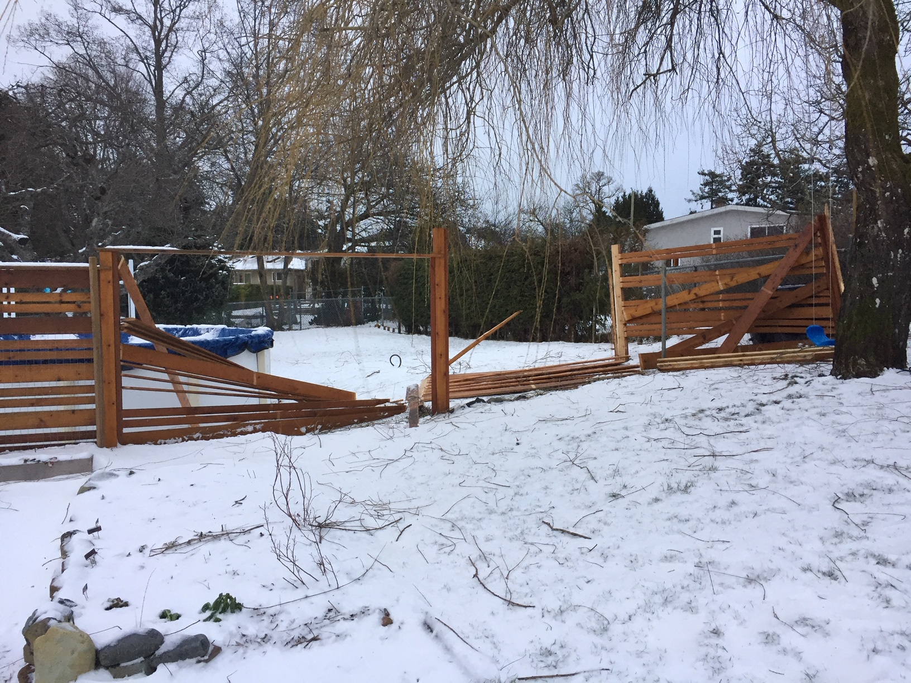
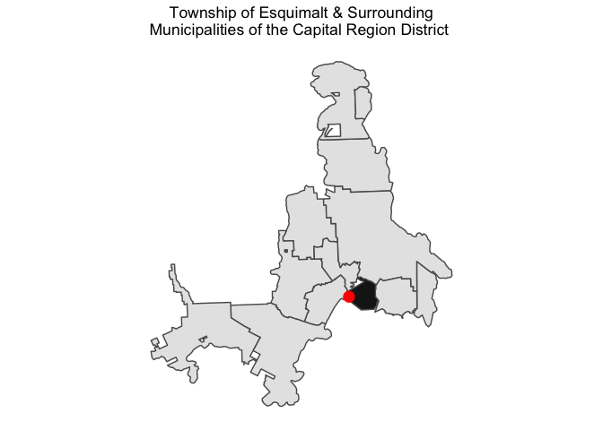
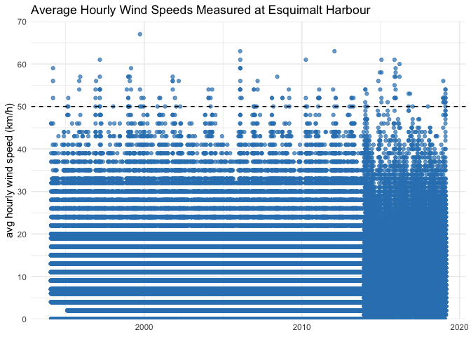
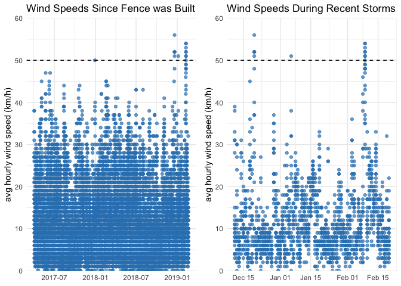
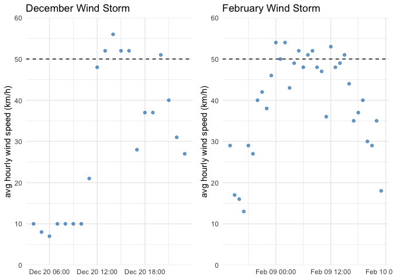

<!-- 
This file is licensed with the Creative Commons Attribution 4.0 International License.
-->

## Weather with `weathercan` 🇨🇦

Victoria, British Columbia—where I live—has had a bit of [wintery
weather](https://www.cheknews.ca/victoria-had-more-february-snow-than-much-of-canada-535410/)
this year.

And.

This happened 😱

</img>

To be fair, [Environment and Climate Change
Canada’s](https://weather.gc.ca/city/pages/bc-85_metric_e.html)
special weather warning that day did say winds could damage buildings
and structures. But seriously, how windy does it need to be to blow down
my 2-year-old fence?

I decided to turn this mini-homeowner drama into a reason to try out the
[rOpenSci](https://ropensci.org/) [`weathercan` R
package](http://ropensci.github.io/weathercan/) 📦. `weathercan` makes it
easier to search for and download weather data from the [Environment and
Climate Change Canada (ECCC)
website](http://climate.weather.gc.ca/historical_data/search_historic_data_e.html).

Let’s find the nearby ECCC weather stations using
`weathercan::station_search()`:

``` r
library(weathercan)

stns <- stations_search(name = "Esquimalt")
stns
```

    ## # A tibble: 7 x 13
    ##   prov  station_name station_id climate_id WMO_id TC_id   lat   lon  elev
    ##   <fct> <chr>        <fct>      <fct>      <fct>  <fct> <dbl> <dbl> <dbl>
    ## 1 BC    ESQUIMALT    50         1012700    <NA>   <NA>   48.4 -123.  13.7
    ## 2 BC    ESQUIMALT    50         1012700    <NA>   <NA>   48.4 -123.  13.7
    ## 3 BC    ESQUIMALT H… 52         1012710    71798  WPF    48.4 -123.   3  
    ## 4 BC    ESQUIMALT H… 52         1012710    71798  WPF    48.4 -123.   3  
    ## 5 BC    ESQUIMALT H… 52         1012710    71798  WPF    48.4 -123.   3  
    ## 6 BC    ESQUIMALT L… 51         1012707    <NA>   <NA>   48.4 -123.  15.2
    ## 7 BC    ESQUIMALT L… 51         1012707    <NA>   <NA>   48.4 -123.  15.2
    ## # … with 4 more variables: tz <chr>, interval <chr>, start <int>,
    ## #   end <int>

Looks like 3 stations for Esquimalt in the station list, however only
one—`ESQUIMALT HARBOUR (52)`—is currently collecting hourly data.

``` r
stn52 <- stns %>% filter(end == 2018 & interval == "hour")
```

A quick map with the `bcmaps` & `sf` R packages confirms the station
(red point) is actually in Esquimalt:

``` r
#municipalities in the Capital Regional District
crd <- c("Central Saanich", "Colwood", "Esquimalt", "Highlands",
         "Langford", "Metchosin", "North Saanich", "Oak Bay", "Saanich",
         "Sidney", "Sooke", "Victoria", "View Royal")

esq <- municipalities() %>% 
  filter(ADMIN_AREA_ABBREVIATION == "Esquimalt")

bcmaps::municipalities() %>% 
  filter(ADMIN_AREA_ABBREVIATION %in% crd) %>% 
  ggplot() +
  geom_sf() +
  geom_sf(data = esq, fill = "grey10") +
  geom_sf(data = st_as_sf(stn52, coords = c("lon", "lat"),
                          crs = 4326),
  size = 4, colour = "red", show.legend = TRUE) +
  coord_sf(datum = NA) +
  labs(title = "Township of Esquimalt & Surrounding\nMunicipalities of the Capital Region District ") +
  theme_minimal() +
  theme(plot.title = element_text(hjust = 0.5))
```

<!-- -->

So let’s grab all the data for station \#52 `ESQUIMALT HARBOUR` using
`weathercan::weather_dl()` and have a look at the wind speeds:

``` r
data <- weather_dl(station_ids = 52)

data %>%
  select(station_id, station_name, date, wind_spd) %>%
  ggplot(aes(x = date, y = wind_spd)) +
  geom_point(colour = "#3182bd", alpha = .7) +
  theme_minimal() +
  labs(x = NULL, y = "avg hourly wind speed (km/h)",
       title = "Average Hourly Wind Speeds Measured at Esquimalt Harbour") +
  geom_hline(yintercept = 50, linetype = 2) +
  scale_y_continuous(limits = c(0, 70),
                     breaks = seq(0, 70, 10),
                     expand = c(0, 0))
```

<!-- -->

Well, that was disapointing 😞, looks like the recent high winds were
*not* that unique afterall—lot’s of [average wind
speeds](http://climate.weather.gc.ca/glossary_e.html#windSpd) in the
same range or even higher in the past couple decades. I was hoping for
something much more dramatic (read explanatory). As a side note, there
looks like there was an instrument change in 2014? 🤷

But I am not ready to give up. The fence was only built in April
2017—maybe we should look at wind speeds since then?

``` r
p1 <- data %>%
  select(station_id, station_name, date, wind_spd) %>%
  filter(date > "2017-04-01") %>%
  ggplot(aes(x = date, y = wind_spd)) +
  geom_point(colour = "#3182bd", alpha = .7) +
  theme_minimal() +
  labs(x = NULL, y = "avg hourly wind speed (km/h)",
       title = "Wind Speeds Since Fence was Built") +
  geom_hline(yintercept = 50, linetype = 2) +
  scale_y_continuous(limits = c(0, 60),
                     breaks = seq(0, 60, 10),
                     expand = c(0, 0))

p2 <- data %>%
  select(station_id, station_name, date, wind_spd) %>%
  filter(date > "2018-12-10") %>%
  ggplot(aes(x = date, y = wind_spd)) +
  geom_point(colour = "#3182bd", alpha = .7) +
  theme_minimal() +
  labs(x = NULL, y = "avg hourly wind speed (km/h)",
       title = "Wind Speeds During Recent Storms") +
  geom_hline(yintercept = 50, linetype = 2) +
  scale_y_continuous(limits = c(0, 60),
                     breaks = seq(0, 60, 10),
                     expand = c(0, 0))

p1 + p2
```

<!-- -->

🎉 The recent blast of wintery weather *was* the first test of the fence
afterall. But why did the fence fair OK with the December winds but fall
over in February? There is a fair bit of over-plotting with these
points, so let’s look *even* closer 👀:

``` r
p3 <- data %>%
  select(station_id, station_name, date, time, wind_spd) %>%
  filter(time >="2018-12-20 04:00:00" & date < "2018-12-21 04:00:00") %>%
  ggplot(aes(x = time, y = wind_spd)) +
  geom_point(colour = "#3182bd", alpha = .7) +
  theme_minimal() +
  labs(x = NULL, y = "avg hourly wind speed (km/h)",
       title = "December Wind Storm") +
  geom_hline(yintercept = 50, linetype = 2) +
  scale_y_continuous(limits = c(0, 60),
                     breaks = seq(0, 60, 10),
                     expand = c(0, 0))

p4 <- data %>%
  select(station_id, station_name, date, time, wind_spd) %>%
  filter(time >="2019-02-08 14:00:00" & date < "2019-02-10 00:00:00") %>%
  ggplot(aes(x = time, y = wind_spd)) +
  geom_point(colour = "#3182bd", alpha = .7) +
  theme_minimal() +
  labs(x = NULL, y = "avg hourly wind speed (km/h)",
       title = "February Wind Storm") +
  geom_hline(yintercept = 50, linetype = 2) +
  scale_y_continuous(limits = c(0, 60),
                     breaks = seq(0, 60, 10),
                     expand = c(0, 0))

p3 + p4
```

<!-- -->

Well one thing we can say about the February storm is that it went on,
and on, and on—high winds recorded for over 12 hours 💨\! Maybe that is
what did my new fence in? Or, maybe it was not average hourly wind
speeds but wind gust speeds? Unfortunately wind gust speed is not
available in the [Environment and Climate Change Canada (ECCC) data
set](http://climate.weather.gc.ca/historical_data/search_historic_data_e.html).

Ah well. Maybe fence version 1 was just not meant to be—version 2 is
underway and *will* be ready for future winter weather 🇨🇦.

  - The `weathercan` R package is part of the [rOpenSci
    project](https://ropensci.org/)—they are transforming science
    through open data and software 💯
  - Learn more `weathercan` authored by [Steffi
    LaZerte](http://steffilazerte.ca/) & Sam Albers
    [here](http://ropensci.github.io/weathercan/)
  - The R source code for this post can be reviewed
    [here](https://github.com/stephhazlitt/some-assembly-required/blob/master/R/fence/fence.Rmd)

2019-02-25
