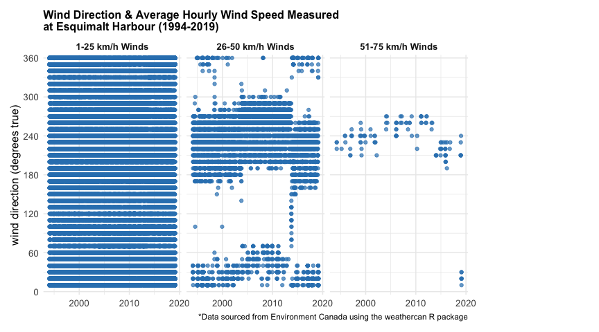
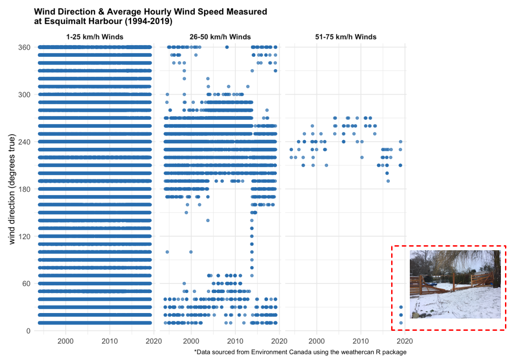

<!-- 
This file is licensed with the Creative Commons Attribution 4.0 International License.
-->

## When You Miss the Target 🎯

  - *Sometimes* you can do a data analysis and not find anything that
    really sparks joy—no correlations, no explanatory patterns 📊

  - *Sometimes* you can do a data analysis and be looking at the wrong
    data 🔍

  - *Sometimes* nice people make suggestions where you might want to
    look 👀

In my [short
post](https://github.com/stephhazlitt/some-assembly-required/blob/master/R/fence/fence.md)
looking at whether average wind speeds (km/h) during the Victoria,
British Columbia February 2019 storm might have explained why my fence
fell down, I didn’t find a “smoking gun” 🔫—the February storm perhaps
lasted longer than ‘usual’ but measured wind speeds were within the
normal range of storm wind speeds since 1994.

A number of people suggested I look at wind direction 💨. So I did. KAPOW
🎉😮

1)  Get and wrangle the [Environment and Climate Change Canada
    (ECCC)](http://climate.weather.gc.ca/historical_data/search_historic_data_e.html)
    [wind direction
    data](http://climate.weather.gc.ca/glossary_e.html#windSpd) using
    the the [rOpenSci](https://ropensci.org/) [`weathercan` R
    package](http://ropensci.github.io/weathercan/) 📦. I filtered out
    wind speeds of zero and grouped wind speed into a three categories
    (1-25 km/h, 26-50 km/h and 51-75 km/h):

<!-- end list -->

``` r
library(weathercan)
library(dplyr)
library(ggplot2)

stn <- stations_search(name = "Esquimalt", interval = "hour") %>% 
  select(station_id) %>% 
  pull()

data <- weather_dl(station_id = stn)

wind_dir <- data %>% 
  select(station_id, station_name, date, wind_spd, wind_dir) %>% 
  filter(wind_spd != 0) %>% 
  mutate(wind_spd_cat = cut(wind_spd, breaks = c(0,25,50,75),
                            labels = c("1-25 km/h Winds",
                                       "26-50 km/h Winds",
                                       "51-75 km/h Winds")))
wind_dir
```

    ## # A tibble: 211,018 x 6
    ##    station_id station_name      date       wind_spd wind_dir wind_spd_cat  
    ##    <chr>      <chr>             <date>        <dbl>    <dbl> <fct>         
    ##  1 52         ESQUIMALT HARBOUR 1994-02-01       11       36 1-25 km/h Win…
    ##  2 52         ESQUIMALT HARBOUR 1994-02-01       11       35 1-25 km/h Win…
    ##  3 52         ESQUIMALT HARBOUR 1994-02-01       15       35 1-25 km/h Win…
    ##  4 52         ESQUIMALT HARBOUR 1994-02-01        9       36 1-25 km/h Win…
    ##  5 52         ESQUIMALT HARBOUR 1994-02-01        7       36 1-25 km/h Win…
    ##  6 52         ESQUIMALT HARBOUR 1994-02-01        9       36 1-25 km/h Win…
    ##  7 52         ESQUIMALT HARBOUR 1994-02-01       11       36 1-25 km/h Win…
    ##  8 52         ESQUIMALT HARBOUR 1994-02-01        7       36 1-25 km/h Win…
    ##  9 52         ESQUIMALT HARBOUR 1994-02-01        9       35 1-25 km/h Win…
    ## 10 52         ESQUIMALT HARBOUR 1994-02-01        9       36 1-25 km/h Win…
    ## # … with 211,008 more rows

2)  Plot wind direction over time for each wind speed category:

<!-- end list -->

``` r
wind_plot <- wind_dir %>% 
  filter(wind_dir != 0) %>% 
  mutate(wind_dir_deg = wind_dir*10) %>% 
  ggplot(aes(x = date, y = wind_dir_deg)) +
  geom_point(colour = "#3182bd", alpha = .7) +
  facet_wrap(~wind_spd_cat) +
  theme_minimal() +
  labs(x = NULL, y = "wind direction (degrees true)",
       title = "Wind Direction & Average Hourly Wind Speed Measured\nat Esquimalt Harbour (1994-2019)",
       caption = "*Data sourced from Environment Canada using the weathercan R package") +
  scale_y_continuous(limits = c(-5, 365),
                     breaks = seq(0, 360, 60),
                     expand = c(0, 0)) +
  theme(axis.text = element_text(size = 10),
        axis.title = element_text(size = 12),
        strip.text = element_text(size = 10, face = "bold"),
        plot.title = element_text(size = 12, face = "bold"),
        plot.margin = unit(c(4,50,4,4),"mm"))
wind_plot
```

<!-- -->

3)  Get fancy with the `magick` R package 📦 and overlay my sad fence
    picture:

<!-- end list -->

``` r
library(magick)

wind_plot_img <- image_read("tmp/wind_dir_plot.png")
fence_img <- image_read("images/fence.jpg")

final_img <- image_composite(image_scale(wind_plot_img, "x800"),
                             image_scale(fence_img, "x150"),
                             offset = "+900+550")
final_img <- image_draw(final_img)
rect(860, 540, 1110, 725, border = "red", lty = "dashed", lwd = 3)
final_img
```

<!-- -->

2019-02-26
